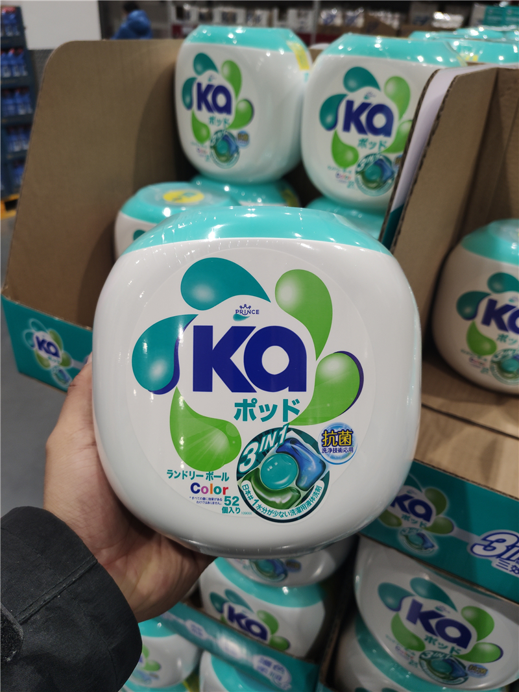

# 图片元素

## img元素

image缩写，空元素

src属性：source图片的链接，可以网上的链接，也可以是本地的图片
```html

本地的图片，使用的是相对路径，图片存在和这个网页html同一个目录的img文件夹下的洗衣液.jpg
```

alt属性：当图片资源失效时，将使用该属性的文字替代图片

## 和a元素联用
点击图片后跳转到该链接
```html
    <a target="_blank"  href="https://b2b.baidu.com/s?q=%E6%B4%97%E8%A1%A3%E6%B6%B2&from=search&fid=40811598&styl=b&sid=151010&bd_vid=12367787548353047667">
        
    </a>

```

## 和map元素联用
map：地图
map的子元素：area
衡量坐标时，为了避免衡量误差，需要使用专业的工具进行衡量：
PS,pxcook

## 和figure元素

指代、定义，通常用于把图片，图片标题，描述包裹起来
让浏览器知道这个标题和描述是和图片绑定的。
但是对页面显示没有影响。
子元素：figcaption

