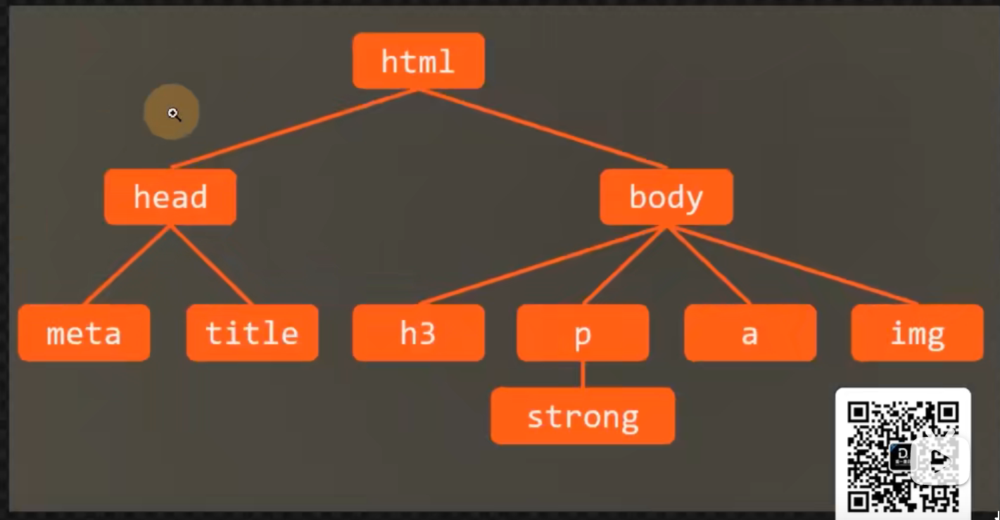
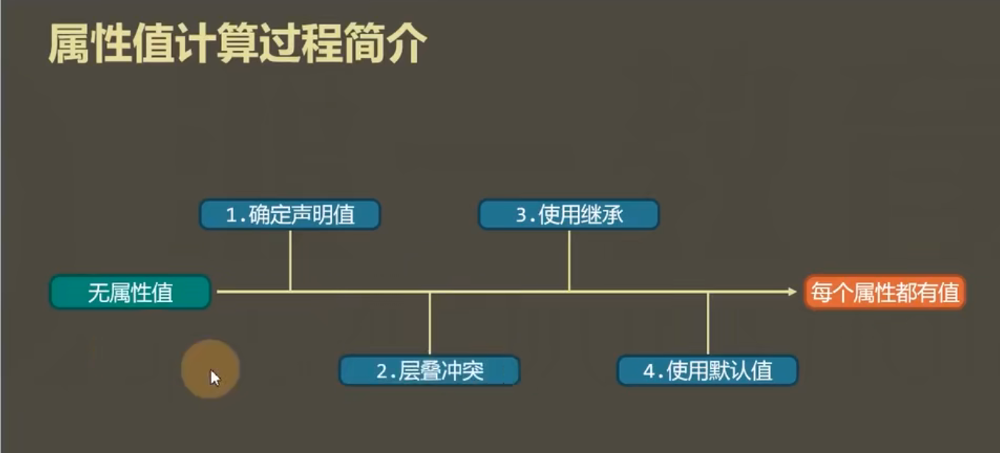

# 属性值的计算过程
即页面的渲染过程
一个元素一个元素依次渲染，顺序按照页面文档的树形目录结构进行



渲染每一个元素的前提条件：该元素的所有CSS属性必须有值。

一个元素，从所有属性都没有值，到所有的属性都有值，这个计算过程，叫做属性值计算过程。**（过程参考PPT）**


特殊的两个CSS取值：

- inherit:手动强制继承，将元素的值取出应用到该元素；
```CSS
    <style>
        a{
            color: inherit;
        }
    </style>
```


- initial:初始值，将该属性设置为默认值
```CSS
    <style>
        div{
            width:100px;
            height: 100px;
            background:lightblue;
        }

        .mydiv{
            background: initial;
        }
    </style>

```